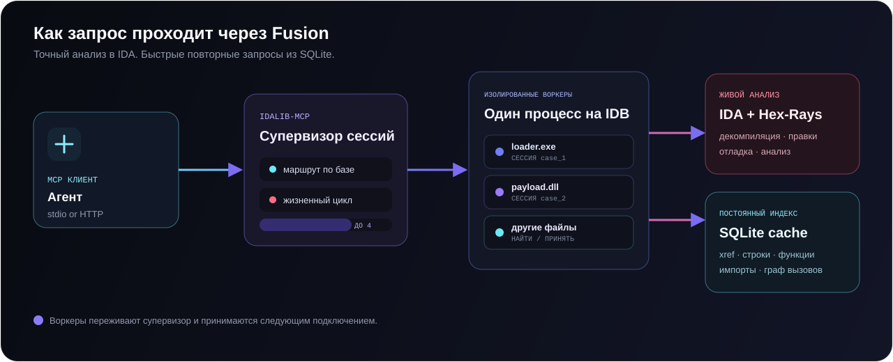

<div align="center">
  
</div>

<!-- mcp-name: io.github.rison1337/ida-pro-mcp-fusion -->

<p align="center">
  <a href="README.md"></a>
  <a href="README.ru.md"></a>
</p>

<p align="center">
  <strong>Одна MCP-точка. Много бинарников. Контекст анализа сохраняется.</strong>
</p>

<p align="center">
  <a href="https://github.com/rison1337/ida-pro-mcp-fusion/releases/latest"></a>
  <a href="https://github.com/rison1337/ida-pro-mcp-fusion/actions"></a>
  
  
  
  <a href="LICENSE"></a>
</p>

<p align="center">
  <a href="#быстрый-старт">Быстрый старт</a> ·
  <a href="#почему-fusion">Почему Fusion</a> ·
  <a href="#архитектура">Архитектура</a> ·
  <a href="#инструменты">Инструменты</a> ·
  <a href="#настройка">Настройка</a>
</p>

## Что такое Fusion?

**IDA Pro MCP Fusion** подключает MCP-совместимых агентов к IDA Pro и превращает одно соединение в полноценное рабочее место для реверсинга. Живой анализ IDA объединён с постоянным SQLite-индексом и supervisor-процессом, который может держать несколько бинарников в изолированных headless-воркерах.

Можно декомпилировать и дизассемблировать функции, исследовать перекрёстные ссылки, типы и граф вызовов, переименовывать символы, патчить данные, создавать сигнатуры и повторно использовать уже построенный анализ.

> [!IMPORTANT]
> Нужна локальная лицензированная установка **IDA Pro**. IDA Free не поддерживается. Сервер не содержит IDA, Hex-Rays и не отправляет бинарники во внешний сервис.

## Почему Fusion

| | Возможность | Что это даёт |
|:--:|---|---|
| ⚡ | **Постоянный SQLite-кэш** | Функции, строки, глобальные переменные, импорты, xref и call graph доступны между запусками. |
| ◈ | **Мульти-бинарный supervisor** | Несколько GUI- или headless-баз управляются через одну MCP-точку. |
| ⛓ | **Живущие воркеры** | Следующее подключение может найти и принять уже запущенный worker для той же базы. |
| ◎ | **Пакетный анализ** | Открытие образцов и построение кэшей выполняется одним `idb_batch_open`. |
| ⛨ | **Контролируемый интерфейс** | Read-only-профили, лимит воркеров, тайм-ауты и opt-in для опасных инструментов. |

Кэш лежит рядом с IDB в файле `<database>.mcp.sqlite`. Актуальность проверяется по времени изменения IDB и версии схемы, поэтому устаревшие данные не выдаются незаметно.

## Быстрый старт

### 1. Что понадобится

- [IDA Pro](https://hex-rays.com/ida-pro) 8.3 или новее; рекомендуется IDA 9.x
- [Python](https://www.python.org/downloads/) 3.11 или новее
- [`uv` / `uvx`](https://docs.astral.sh/uv/)
- MCP-клиент, который умеет запускать локальный stdio-сервер

Установите `uv`, если его ещё нет:

```bash
python -m pip install uv
```

Один раз активируйте headless Python от IDA:

```powershell
# Windows — при необходимости измените версию и путь к IDA
uv run "C:\Program Files\IDA Professional 9.3\idalib\python\py-activate-idalib.py"
```

```bash
# macOS — при необходимости измените версию и путь к IDA
uv run "/Applications/IDA Professional 9.3.app/Contents/MacOS/idalib/python/py-activate-idalib.py"
```

### 2. Добавьте MCP-сервер

Рекомендуемая конфигурация запускает код напрямую из этого репозитория:

```json
{
  "mcpServers": {
    "ida-pro-mcp-fusion": {
      "command": "uvx",
      "args": [
        "--from",
        "git+https://github.com/rison1337/ida-pro-mcp-fusion",
        "idalib-mcp",
        "--stdio"
      ]
    }
  }
}
```

Для Claude Code:

```bash
claude mcp add ida-pro-mcp-fusion -- uvx --from git+https://github.com/rison1337/ida-pro-mcp-fusion idalib-mcp --stdio
```

Готовый MCPB-пакет доступен в [последнем релизе](https://github.com/rison1337/ida-pro-mcp-fusion/releases/latest).

### 3. Откройте базу

Попросите подключённого агента начать так:

```python
idb_open(
    "C:/samples/target.exe",
    preferred_session_id="target",
    build_caches=True,
    init_hexrays=True,
)
```

Каждый следующий вызов анализа получает явный ID базы:

```python
survey_binary(database="target")
decompile("main", database="target")
xrefs_to("WinMain", database="target")
cache_callgraph_hotspots(limit=25, database="target")
```

## Архитектура

<div align="center">
  
</div>

1. MCP-клиент запускает `idalib-mcp` через stdio или HTTP.
2. Supervisor создаёт или принимает по одному worker-процессу на каждый бинарник.
3. Каждый вызов содержит `database`, поэтому запрос попадает в нужную IDB-сессию.
4. IDA выполняет живой анализ и изменения, а cache-инструменты читают индекс из SQLite.
5. Воркеры остаются обнаруживаемыми на компьютере и завершаются после периода простоя.

`idb_open` поддерживает четыре режима:

| Режим | Поведение |
|---|---|
| `prefer_headless` | Использовать или создать idalib-worker. Режим по умолчанию. |
| `force_headless` | Не принимать запущенный GUI-процесс. |
| `prefer_gui` | Принять подходящий GUI, а если его нет — создать worker. |
| `force_gui` | Принять GUI или запустить новый процесс IDA. |

## Работа с несколькими бинарниками

Открыть несколько образцов и оставить все сессии доступными:

```python
idb_batch_open(
    [
        "C:/samples/loader.exe",
        "C:/samples/payload.dll",
        "C:/samples/helper.dll",
    ],
    session_prefix="case42",
    refresh_cache=True,
    cache_include_xrefs=True,
)
```

Для большого корпуса можно построить кэш и сразу освободить worker:

```python
idb_batch_open(
    ["C:/corpus/a.exe", "C:/corpus/b.exe", "C:/corpus/c.exe"],
    close_after_cache=True,
    retry_without_auto_analysis_on_timeout=True,
)
```

Управление сессиями:

```python
idb_list()
idb_close(database="case42_1_loader")
```

## Инструменты

В кодовой базе зарегистрировано **75 инструментов анализа IDA**, а supervisor добавляет управление мульти-бинарными сессиями. Видимый клиенту список намеренно меняется: debugger-инструменты являются расширением, опасные операции отключены без явного разрешения, а профиль может оставить только выбранные имена.

| Область | Примеры |
|---|---|
| Сессии | `idb_open`, `idb_batch_open`, `idb_list`, `idb_close`, `idb_save` |
| Обзор и декомпиляция | `survey_binary`, `decompile`, `disasm`, `analyze_function`, `analyze_component` |
| Поиск и связи | `find`, `find_bytes`, `search_text`, `xrefs_to`, `callees`, `callgraph`, `trace_data_flow` |
| Постоянный кэш | `cache_status`, `refresh_cache`, `cache_entity_query`, `cache_xrefs`, `cache_callgraph_hotspots`, `cache_find_regex` |
| Типы и стек | `declare_type`, `type_inspect`, `set_type`, `infer_types`, `stack_frame`, `declare_stack` |
| Изменение базы | `rename`, `set_comments`, `define_func`, `define_code`, `patch_asm`, `make_data` |
| Сигнатуры | `make_signature`, `make_signature_for_function`, `make_signature_for_range`, `find_xref_signatures` |
| Debugger-расширение | `dbg_start`, `dbg_bps`, `dbg_regs`, `dbg_stacktrace`, `dbg_read`, `dbg_write` |

## Настройка

### Пул воркеров

```bash
uvx --from git+https://github.com/rison1337/ida-pro-mcp-fusion \
  idalib-mcp --stdio --max-workers 4
```

| Параметр / переменная | Назначение |
|---|---|
| `--max-workers N` | Максимум одновременно работающих баз; `0` — без лимита. По умолчанию `4`. |
| `IDA_MCP_MAX_WORKERS` | Значение лимита по умолчанию из окружения. |
| `IDA_MCP_OPEN_TIMEOUT` | Максимальное время автоанализа при открытии в секундах. По умолчанию `1800`. |
| `IDA_MCP_LOAD_TIMEOUT` | Максимальное время загрузки без автоанализа. По умолчанию `300`. |

### Ограниченные профили

Оставить только выбранные инструменты:

```bash
idalib-mcp --stdio --profile profiles/readonly.txt
```

- [`profiles/readonly.txt`](profiles/readonly.txt) — просмотр без инструментов изменения
- [`profiles/triage.txt`](profiles/triage.txt) — компактный набор для первичного анализа

### HTTP

```bash
idalib-mcp --host 127.0.0.1 --port 8745
```

GUI-мост:

```bash
ida-pro-mcp --transport http://127.0.0.1:8744/sse
```

Для установки GUI-плагина:

```bash
python -m pip install https://github.com/rison1337/ida-pro-mcp-fusion/archive/refs/heads/main.zip
ida-pro-mcp --install
```

После установки перезапустите IDA и MCP-клиент.

## Безопасность

- По умолчанию сервер слушает только loopback. Не открывайте его в недоверенную сеть.
- Изменяющие и произвольные Python-инструменты помечены как unsafe и выключены по умолчанию.
- `py_eval`, `py_exec_file`, debugger-команды и патчинг могут выполнять код или менять IDB.
- Непроверенные бинарники анализируйте в той же изоляции, что и при ручном malware analysis.

Включить unsafe-инструменты можно явно:

```bash
idalib-mcp --stdio --unsafe
```

## Решение проблем

<details>
<summary><strong><code>uvx</code> не найден</strong></summary>

Установите `uv` командой `python -m pip install uv`, откройте новый терминал и проверьте `uvx --version`.
</details>

<details>
<summary><strong>Несовместимая версия Python или IDA</strong></summary>

Запустите `idapyswitch`, выберите Python 3.11+, затем снова выполните `py-activate-idalib.py`.
</details>

<details>
<summary><strong>Ошибка о том, что нужен <code>database</code></strong></summary>

Вызовите `idb_list()` и передайте возвращённый `session_id` как `database=`. Пути и имена файлов вместо ID сессии не принимаются.
</details>

<details>
<summary><strong>Достигнут лимит воркеров</strong></summary>

Закройте неиспользуемую сессию через `idb_close`, увеличьте `--max-workers` или используйте `close_after_cache=True`.
</details>

## Разработка

```bash
git clone https://github.com/rison1337/ida-pro-mcp-fusion.git
cd ida-pro-mcp-fusion
python -m pip install pytest jsonschema "mcp>=1.0" "tomli-w>=1.0"
python -m pytest -q tests
```

Для тестов, которым нужна сама IDA:

```bash
uv run ida-mcp-test tests/typed_fixture.elf -q
```

Новые инструменты находятся в `src/ida_pro_mcp/ida_mcp/api_*.py` и регистрируются через `@tool`. Тесты supervisor и lifecycle — в `tests/`.

## Проект и авторство

**Fusion Edition** поддерживается [rison1337](https://github.com/rison1337).

Проект основан на MIT-кодовой базе [`mrexodia/ida-pro-mcp`](https://github.com/mrexodia/ida-pro-mcp). Постоянный кэш и headless-оркестрация также используют идеи из [`QiuChenly/ida-pro-mcp-enhancement`](https://github.com/QiuChenly/ida-pro-mcp-enhancement) и [`winmin/ida-headless-mcp`](https://github.com/winmin/ida-headless-mcp). Атрибуция сохранена в README и истории исходников; упаковка Fusion, cache-инструменты, batch workflow и lifecycle сессий поддерживаются в этом репозитории.

## Лицензия

Проект распространяется по [MIT License](LICENSE). IDA Pro и Hex-Rays — товарные знаки Hex-Rays SA и не входят в состав проекта.
